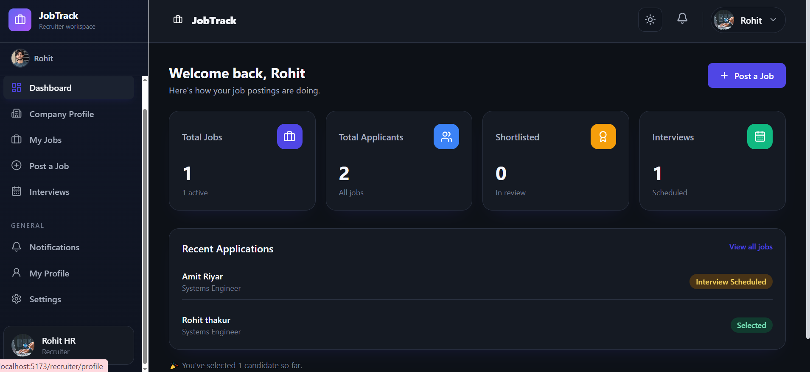
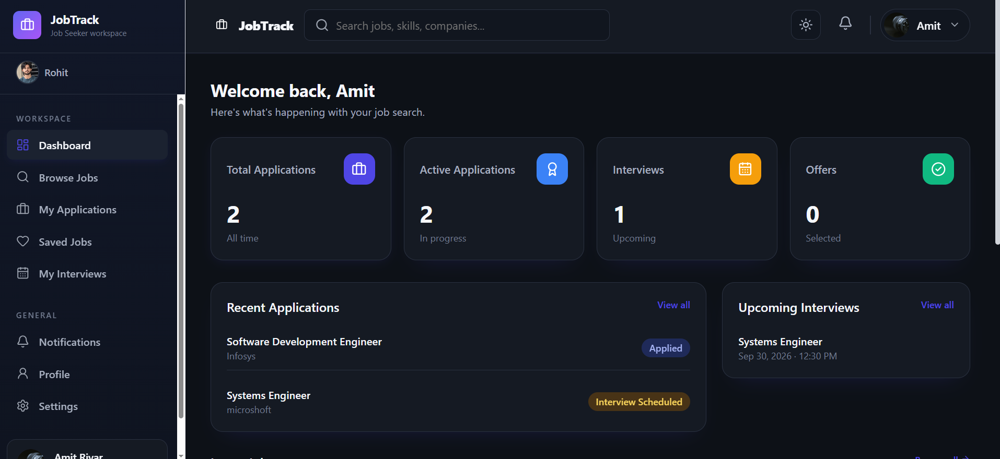
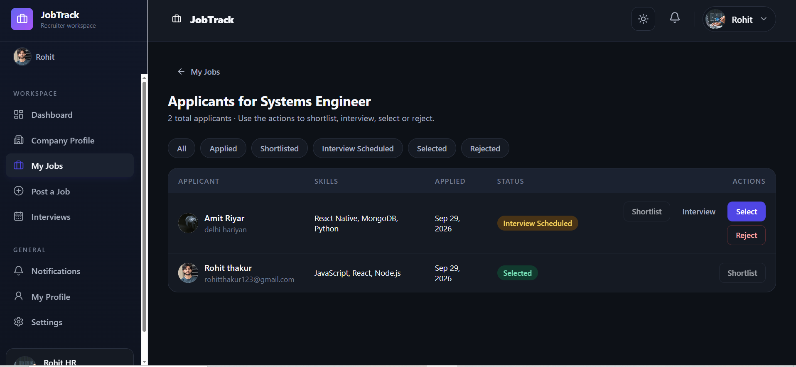
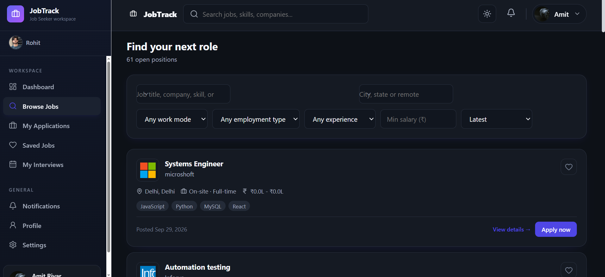
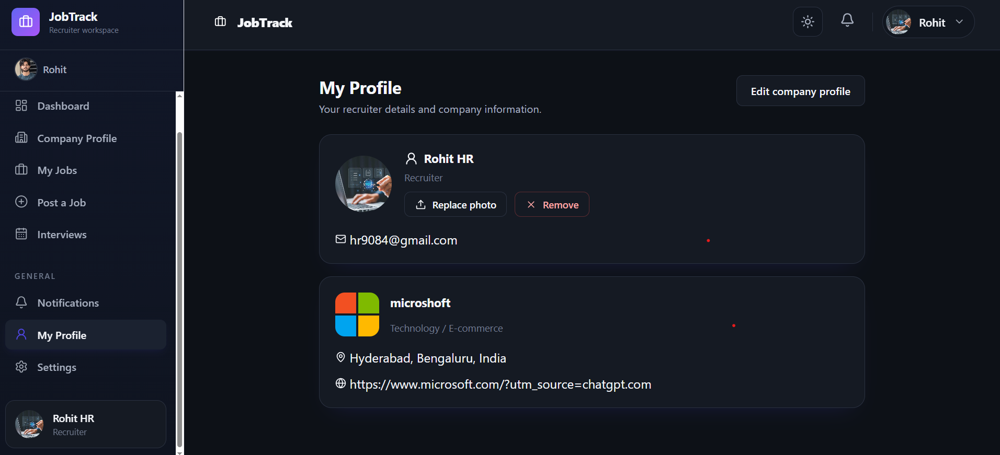

# 💼 JobTrack

**A full-stack, multi-role job portal — like a mini Naukri/LinkedIn — built with the MERN stack.**

Job seekers build a real profile (resume, education, skills, projects) and apply to jobs.
Recruiters post jobs, review applicants, and take them from *Applied → Shortlisted →
Interview Scheduled → Selected*, all backed by a real MongoDB database with JWT auth and
role-based access control.

<!-- Badges: replace the two URLs below with your real deployed links once live -->
[](https://your-frontend-url.vercel.app)
[](https://your-backend-url.onrender.com/api/health)


---

## 📸 Screenshots

> Add your own screenshots to a `screenshots/` folder in the repo root, then the images below
> will render automatically on GitHub. See **"How to add screenshots"** at the bottom of this
> file for exact steps and a shot list.

| Recruiter Dashboard | Job Seeker Dashboard |
|---|---|
|  |  |

| Applicants & Interview Scheduling | Candidate Profile |
|---|---|
|  |  |

| Job Search | Recruiter Profile |
|---|---|
|  |  |

| Job Details | Job Seeker Profile |
|---|---|
|  |  |

---

## ✨ Features

**For Job Seekers**
- Sign up, build a real profile — headline, about, skills (with autocomplete search), education,
  experience, and projects
- Upload a resume (PDF) and a profile photo — both stored properly, not just local state
- Search jobs by title, company, location, or skill
- Apply with one click — your saved profile + resume are reused automatically
- Track every application's status and see scheduled interviews with the meeting link

**For Recruiters**
- Create a company profile (logo, industry, size, location, website)
- Post unlimited jobs — each saved as its own record, full CRUD on "My Jobs"
- Review applicants with full candidate detail (skills, education, experience, projects, resume)
- Move a candidate through **Shortlist → Schedule Interview → Select / Reject**, with the
  candidate notified at each step
- Open a candidate's full profile page directly from their name/photo
- Dashboard stats (total jobs, applicants, shortlisted, interviews) computed live from MongoDB —
  never hardcoded

**Platform**
- JWT authentication with role-based route protection (job seeker / recruiter)
- Ownership enforced server-side — a recruiter only ever sees their own jobs/applicants
- Persistent MongoDB storage throughout — nothing survives on fake frontend-only state
- Responsive dark UI that works on desktop and mobile

---

## 🛠 Tech Stack

| Layer | Tech |
|---|---|
| Frontend | React, Vite, React Router |
| Backend | Node.js, Express |
| Database | MongoDB + Mongoose |
| Auth | JWT (JSON Web Tokens) |
| File uploads | Multer |
| Deployment | Render (API) + Vercel/Netlify (frontend) |

## 🧱 Architecture

```
React (Vite)  →  Express REST API  →  MongoDB
  fetch()          JWT auth            Users, Companies, Jobs,
                                        Applications, Interviews
```

## 📁 Project Structure

```
JobTrack/
├── Backend/     Node.js + Express + MongoDB API (its own package.json)
└── Frontend/    React + Vite app                (its own package.json)
```

---

## 🚀 Getting Started

### 1. Database
Use a local MongoDB instance, or a free [MongoDB Atlas](https://www.mongodb.com/cloud/atlas)
cluster — either way you'll need a connection string.

### 2. Backend
```bash
cd Backend
cp .env.example .env      # Windows: copy .env.example .env
```
Set at least `MONGODB_URI` and `JWT_SECRET` in `.env`
(generate a secret with `node -e "console.log(require('crypto').randomBytes(48).toString('hex'))"`).
```bash
npm install
npm run dev                # http://localhost:5000
```
Check `http://localhost:5000/api/health` → `{"status":"ok","database":"connected"}`.

### 3. Frontend
In a second terminal:
```bash
cd Frontend
npm install
npm run dev                 # http://localhost:5173
```

### Optional: demo data
```bash
cd Backend
npm run seed:demo
```
Seeds 50 real company names with one sample job listing each, so the app doesn't look empty.

---

## 🔌 API Overview

All routes need `Authorization: Bearer <token>` except signup/login, `/health`, and public
job/company browsing.

| Resource | Examples |
|---|---|
| Auth | `POST /api/auth/signup`, `POST /api/auth/login`, `GET /api/auth/me` |
| Profile | `PATCH /api/users/me`, `POST /api/users/me/resume`, `POST /api/users/me/photo` |
| Companies | `GET /api/companies`, `PUT /api/companies/me` |
| Jobs | `GET /api/jobs`, `POST /api/jobs`, `GET /api/jobs/mine` |
| Applications | `POST /api/applications`, `GET /api/applications/recruiter/summary` |
| Interviews | `POST /api/interviews`, `GET /api/interviews/recruiter/mine` |

---

## 🗺 Roadmap
- [ ] Move resume/photo storage to cloud storage (Cloudinary) so files survive redeploys
- [ ] Email notifications for interview scheduling
- [ ] In-app messaging between recruiter and candidate

---

## 📷 How to add screenshots

1. Create a folder named `screenshots` in the repo root.
2. Capture these pages (in order of impact for a recruiter skimming your repo):
   - Recruiter Dashboard (`recruiter-dashboard.png`) ✅ done
   - Applicants page with a candidate open + status actions (`applicants.png`) ✅ done
   - Job Seeker Dashboard (`seeker-dashboard.png`) ✅ done
   - Browse Jobs / search page (`job-search.png`) ✅ done
   - Recruiter Profile — with photo upload (`recruiter-profile.png`) ✅ done
   - **Still needed:** one individual job's Job Details page (`job-details.png`) — open any job
     from Browse Jobs and screenshot that page, not the search list
   - **Still needed:** Candidate's full profile page (`candidate-profile.png`) — from Applicants,
     click a candidate's name/photo, then screenshot that page
   - **Still needed:** Job Seeker's own Profile page — resume/education/skills/projects
     (`seeker-profile.png`)
3. Save each as a `.png`, exact filenames as above, into `screenshots/`.
4. `git add screenshots && git commit -m "Add screenshots" && git push` — GitHub will render
   them in this README automatically, since the paths above are relative.

---

## 👤 Author

**Rohit Thakur** — [GitHub](https://github.com/RohitThakur9675)